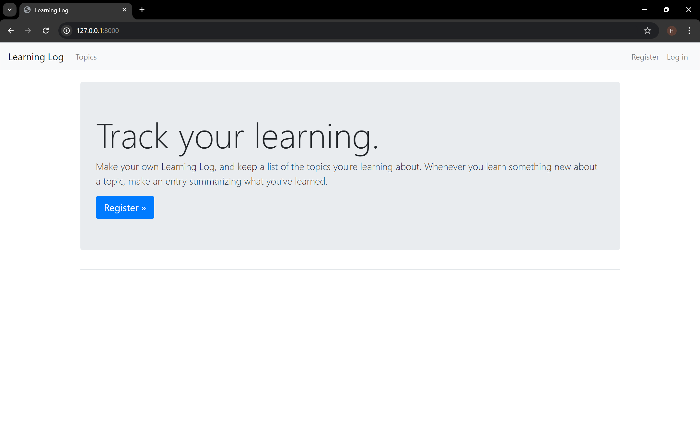
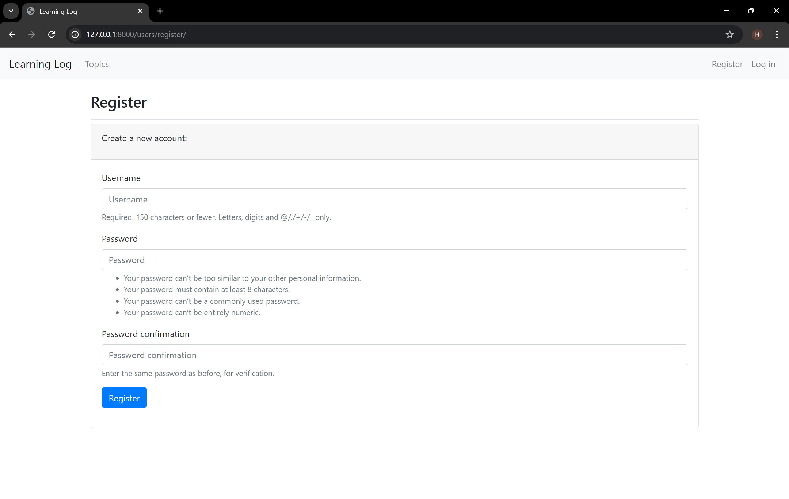
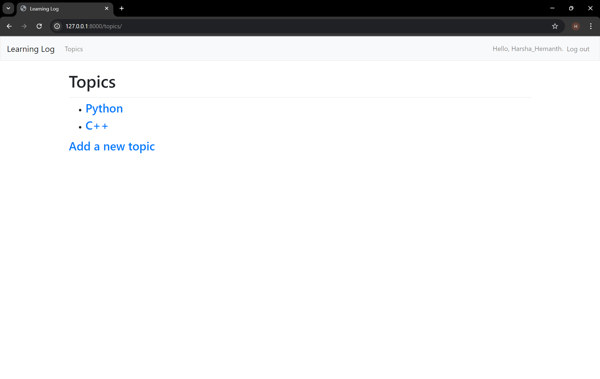
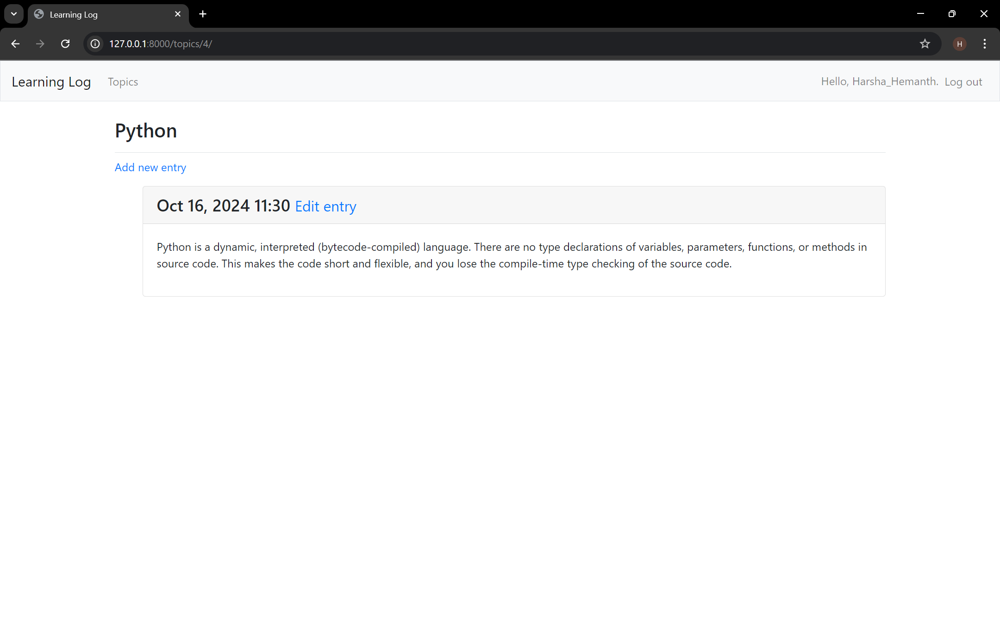

# 📝 Learning Log

The **Learning Log** is a web application that allows users to track topics they are learning about and make entries on those topics. Built with Django, it provides a simple and intuitive interface for organizing and reflecting on your learning journey.

## 🚀 Features
- **User Authentication**: Sign up, log in, and log out functionality.
- **Topic Management**: Add, view, and edit learning topics.
- **Entry Management**: Create, view, and edit the entries related to specific topics.
- **Responsive Design**: Built with Bootstrap for a clean and responsive user interface.
- **Privacy Focused**: User data is secure, and authentication is managed through Django's built-in system.

## 📋 Prerequisites
Make sure you have the following installed:

- Python 3.11 or higher
- Django: Web framework for building the application
- Bootstrap: For responsive design (included in the project)
  
## 🛠️ Installation

1. Clone the repository:
  
    ```bash
    git clone https://github.com/Harsha-Hemanth/Learning-log.git
    cd Learning-log
    ```

2. Create and activate a virtual environment (optional but recommended):

    ```bash
    python3 -m venv venv
    source venv/bin/activate  # On Windows use: venv\Scripts\activate
    ```

3. Apply migrations:

    ```bash
    python manage.py migrate
    ```

## 📜 Usage
1. Run the Django development server:

    ```bash
    python manage.py runserver
    ```

2. Open your browser and go to `http://127.0.0.1:8000` to start using the application.
   
   

4. Sign up for an account, create topics, and add entries to track your learning progress.

   
   
   

## 🧰 Technologies Used
- **Django**: Python web framework
- **Bootstrap**: Frontend framework for responsive design
- **SQLite**: Default Django database for development purposes

## 🤖 How It Works
1. **User Authentication**: Users can register and log in to manage their own learning logs.
2. **Topic and Entry Management**: Users can create and edit topics and entries.
3. **Frontend**: The interface is styled using Bootstrap for a clean and modern user experience.
4. **Backend**: The application logic is handled by Django with models for Topics and Entries.

## 💡 Future Enhancements
- Add search functionality to filter topics and entries.
- Implement notifications for updates or reminders.
- Allow users to upload and attach resources (e.g., PDFs, images) to their entries.

## 👤 Author
- **[Harsha Hemanth](https://github.com/Harsha-Hemanth)** - Developer & Maintainer
